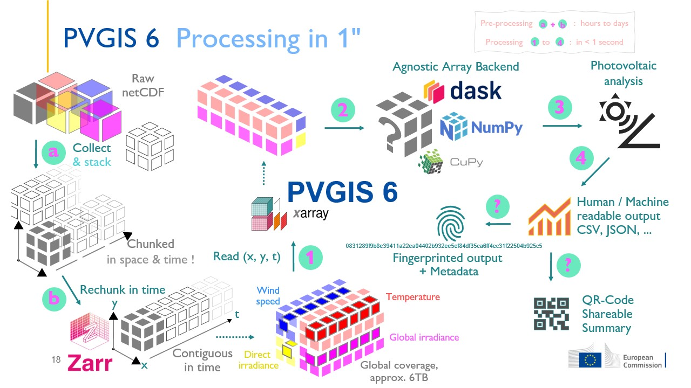

# PVGIS 

###### What is PVGIS ?

The _**P**hotovoltaic **G**eographic **I**nformation **S**ystem_[^*][^**][^***]
is the 🇪🇺  European Commission's
public web service
for estimating photovoltaic ⚡ energy production
and 🔆 solar radiation.


###### What is PVGIS version 6 ?

**PVGIS version 6**  _( <u>this repository</u> )_
is a redevelopment of the software that powers
the European Commission’s public web service for solar energy.
Based on [Python](https://www.python.org/) & [NumPy](https://numpy.org/),
this new version is
feature rich,
performant
and accessible via multiple interfaces -- __Web API__, __CLI__, __core API__.

###### What can PVGIS 6 do ?

**PVGIS**
provides location-specific solar energy calculations
for any point on Earth 🌍
and supports
researchers, engineers, and solar enthusiasts worldwide
to build informed decisions about solar energy projects.
> Refer to the following sections for details and examples !

###### Who is PVGIS 6 for ?

***For everyone!***
Citizens & Prosumers,
Professionals
as well as Researchers & Developers
can use the multiple interfaces
giving them the right mix of ease of use and complexity.

> 🤝 Please  **Respect Authorship**,
> **Read the Licence Terms**
> and **Contribute Back**
> whenever you reuse or extend the source code.

###### What is the science behind PVGIS 6 ?

- Solar Positioning : NOOA Solar geometry, Jenčo 1992​
- Irradiance Modelling : Hofierka 2002, Muneer 1990, Martin & Ruiz 2005​
- Photovoltaic Performance : Huld et al. 2011, Faiman 2008


###### Open by Design

**PVGIS**
is developed and maintained by

  > the _Energy Efficiency & Renewables Unit (Ispra)_  
  > under the _Energy, Transport & Climate directorate_  
  > in the _Joint Research Centre_ [(JRC)][JRC], _🇪🇺 European Commission_

This project
is built exclusively from open-source components
and aligns with the [European Open Source
Strategy](https://commission.europa.eu/about/departments-and-executive-agencies/digital-services/open-source-software-strategy_en).

***

#### ⚠️ Important

This repository hosts **PVGIS 6**,
a brand‑new all‑Python & NumPy implementation of _PVGIS_ [^*].
It is a prototype meant to replace the legacy C/C++ engine
behind the current public web service.

_Expect changes, occasional rough edges, and updates to this `ReadMe` itself._

> An open‑source software article
> describing PVGIS
> 6 is being prepared for the *Journal of Open‑Source Software (JOSS)*.

> 🤝 Please  **Respect Authorship**,
> **Read the Licence Terms**
> and **Contribute Back**
> whenever you reuse or extend the source code.

<!-- Section References -->

[JRC]: https://joint-research-centre.ec.europa.eu/index_en

[^*]: The official Web API service[^****] [Photovoltaic Geographical Information System version 5.x][PVGIS 5.x] is currently powered by an internal software implementation in C/C++.

[^****]: The _PVGIS Web API 5.x_ receives an etimated traffic of `> 50K` requests / week. See also : [Web Traffic](reference/web_traffic.md).

[^**]: See also the [landing page of the PVGIS Web Application 5.x][PVGIS 5 landing page].

[^***]: __This repository__ implements and documents the _new all‑Python_ backend source code , informally referred to as _PVGIS 6_, that will eventually power future versions of the Web API and Frontend.

[PVGIS 5.x]: https://re.jrc.ec.europa.eu/pvg_tools/en/
[PVGIS 5 landing page]: https://joint-research-centre.ec.europa.eu/photovoltaic-geographical-information-system-pvgis_en

***

## ✨ What PVGIS Does

**As a Stand-Alone Software**

- ⚡ **Estimate the photovoltaic potential** for various technologies
- 🔆 **Analyse the solar irradiance** -- global, direct and diffuse irradiance components
- ∡ **Solar position analysis** based on various algorithms, the default being NOAA's solar geometry model
- ∡ **Identify the optimal solar positioning** based on various algorithms
- 📈 **Generate time series** of photovoltaic performance, solar radiation, temperature, wind speed
- ⛅ **Compile a Typical Meteorological Year** for climate variables supporting multiple methods [^****]
- 🫆 **Fingerprint** reproducible calculations
- ▒ **QR code** shareable results

[^****]: Pending completion

**As a Service**

> Coming soon.

**A Technical Polyglot for Solar Energy**

PVGIS 6 is both a _scientific_ and a _technical_ polyglot.
Since its inception in 2022,
it has been designed to bridge the diverse worlds of solar-energy stakeholders.

The following slide highlights features that may power a Software-as-a-Service,
yet it showcases the breadth and depth of PVGIS 6’s backend mechanics.


## 🌞 How does PVGIS 6 work ?

PVGIS processes
large & location‑specific time series
of solar irradiance
and related meteorological variables
to estimate the photovoltaic (PV) power output
over any chosen period that overlaps the temporal span of the input data.

**Data preparation**

Massive continuous time‑series datasets
are sliced into fine spatial “chunks.”
Key is the right chunk size,
i.e., designing an efficient internal data structure.

**On‑the‑fly processing**

Once the chunked time series are ready, however,
PVGIS computes the PV power output
for a given location and time span in real time.
On a modern laptop this typically takes under a second.

> Chunked time series are not required if speed is not a concern.
> PVGIS consumes any kind of data supported by the Xarray library.

[Xarray]: https://docs.xarray.dev



**Performance**

> Coming soon : Update with relevant hardware specifications.

Processing multiple meteorological time series data
over a geographic location
in under a second !


**Scalability**

Scalability tests are on-going and pending completion.  As there is no-one
universal solution out there for caching and scaling a Web API server, it'll
take some time to get the right fine tuning.  However, the Web API is
functional and performant. And it seems to scale rather satisfying with a great
margin for further improvement.

The following example demonstrates a mini-scalability test.

  [](https://asciinema.org/a/03wWgzLwUzVEnxaGcQ7LKnFCt)

In addition,
the following summary of tests in some workstation-grade hardware,
verify the expectations for a fast and responsive Web API service

| 🔁 Batch Size | 🖱️ Requests | ✅ Success Rate | ⏱️ Duration (s) | ⏲️ Avg Time / Request (s) | 🚀 Requests / Sec | 🗃️ Cache Entries | 📦 Output Size | 🔗 Endpoint           |
|---------------|-------------|-----------------|-----------------|---------------------------|-------------------|------------------|----------------|-----------------------|
| 100           | 10,000      | 99.98%          | 335.07          | 0.033                     | 29.84             | 9,934            | ~9MB           | /power/broadband-demo |
| 200           | 10,000      | 99.99%          | 246.65          | 0.025                     | 40.54             | 9,902            | ~9MB           | /power/broadband-demo |
| 500           | 10,000      | 100%            | 191.73          | 0.019                     | 52.15             | 9,902            | ~9MB           | /power/broadband-demo |
| 1000          | 10,000      | 99.99%          | 177.23          | 0.017                     | 56.42             | 9,924            | ~9MB           | /power/broadband-demo |
| 500           | 10,000      | 99.97%          | 333.60          | 0.033                     | 29.97             | 7,024            | ~32MB          | /performance          |
| 1000          | 10,000      | 95.63%          | 296.88          | 0.030                     | 33.68             | 8,282            | ~32MB          | /performance          |


### 📸 Sreenshots

#### Web API

> Coming soon.

#### Command Line Interface

- Overview of `irradiance`, `power` and `performance` commands

  [](https://asciinema.org/a/jGFGWuP6D99EpJwk3tXjXbnwM)

- ⚡ __Photovoltaic Potential__ for various technologies in grid-connected & stand-alone systems

  

- __Solar Irradiance Analysis__ for global, direct and diffuse Irradiance based on Hofierka (2004)

  

- __Solar Position Analysis__ based on various algorithms, the defaul being NOAA's solar geometry model

  

- 🫆 [Fingerprint](cli/fingerprint.md)ed reproducible calculations & ▒ [QR-Code](cli/qrcode.md) shareable results
  
  

  > This QR-Code is _not_ a _link_.
  > It is simple text
  > (i.e. a summary of the output from a photovoltaic performance calculation)
  > encoded as an image !

- Variables of a Typical Meteorological Year via multiple methods

  

  > The TMY engine is pending completion to actually output a _Typical Year_.

#### Core API

> Coming soon.

## 🔓 PVGIS 6 is __Open by Design__

> *Public Money 👥💶, Public Code 👥`01`*  

{align=right height=100px width=100px}

- Core [API](#) based on NumPy
- [Web API](#) based on FastAPI
- [CLI](#) based on Typer

## 📜 License

PVGIS is released under the **European Union Public Licence (EUPL) v1.2**.
This ensures the software remains open and freely available
while protecting both contributors and users.

See :

- [LICENSE](LICENSE) for full details
- [NOTICE](NOTICE) for licenses of software used by PVGIS that is developed by third parties

> 🤝 Please  **Respect Authorship**,
> **Read the Licence Terms**
> and **Contribute Back**
> whenever you reuse or extend the source code.

## 🚀 Quick Start

### Requirements  & Recommendations

- An operating system that supports Python
- A Python virtual environment for a safe & clean installation
- Use `uv` for fast & reliable installations

### Install uv

First, [**install `uv`**](https://docs.astral.sh/uv/getting-started/installation/)

### Simple installation

#### TL;DR 

For the impatient,
launch a terminal,
navigate inside a local directory in your system
and copy-paste-execute the following batch of commands
to install PVGIS using `uv` in a dedicated environment :

```bash
git clone -b main https://code.europa.eu/pvgis/pvgis
cd pvgis
uv venv .pvgis_virtual_environment
source .pvgis_virtual_environment/bin/activate
uv pip install .
pvgis-prototype --version
```

  [](https://asciinema.org/a/SbTqzZDafZuI0IhyIuVJQcINm)

#### Step-by-Step

Would you rather like to understand each step of the installation process ?

A **safe and clean** way to install `pvgis` is
to clone the `main` branch of the source code
and use `uv` to install it in an isolated environment :

##### 2. Clone the source code

Next, clone the source code

```bash
# Inside some local directory in your system
git clone -b main https://code.europa.eu/pvgis/pvgis
cd pvgis
```

##### 3. Create a virtual environment

Before installing PVGIS,
create an isolated virtual environment
to avoid _polluting_ the system.
In addition,
removing a dedicated environment
is easy and leaves no traces behind.

```bash
uv venv .pvgis_virtual_environment
```

##### 4. Install PVGIS

Finally, install PVGIS via

``` bash
source .pvgis_virtual_environment/bin/activate
uv pip install .
```

This will install the algorithms, the core API and the CLI components.

If you wish to install the Web API, then try :

```bash
uv pip install .[web]
```

##### 5. Verify installation

```bash
pvgis-prototype --version
```

If the installation is successful,
and with the virtual environment activated,
we can use PVGIS commands !

```bash
pvgis-prototype --help
```

##### 6. Deactivate the environment

Done working with PVGIS ?
Deactivate the virtual environment with:

```bash
deactivate
```

### Advanced installation

For active development with automatic environment management,
a nice way is to combine the use of `direnv` and `uv`

#### Prerequisites

1. [**Install `uv`**](https://docs.astral.sh/uv/getting-started/installation/)

2. [**Install direnv**](https://direnv.net/docs/installation.html)

3. [**Hook direnv to your shell**](https://direnv.net/docs/hook.html)

4. Consult [Restoring the PS1](https://github.com/direnv/direnv/wiki/Python#restoring-the-ps1), alternatively [Override $PS1](https://github.com/direnv/direnv/wiki/PS1)

5. [Use `uv` as an environment builder](https://github.com/direnv/direnv/wiki/Python#uv)

#### Setup the project

##### 1. Clone the source code

   See above

##### 2. Let `direnv` manage the virtual environment 

   You may use the following configuration for `direnv` :
   copy it in a file named `.envrc`,
   _inside_ the root directory of PVGIS' source code.

   ```bash
   export VIRTUAL_ENV=.pvgis-prototype_virtual_environment
   export UV_PROJECT_ENVIRONMENT=.pvgis-prototype_virtual_environment
   layout uv
   export CUSTOM_PS1=mycustomPS1
   ```

   and

   ```bash
   direnv allow
   ```

The virtual environment **activates automatically**
whenever we `cd` into the project directory !
Plus,
it **deactivates** once we `cd` out of the project directory !

##### 3. Install PVGIS in _editable_ mode

We can install PVGIS in editable mode
-- every modification to the source code is directly reflected at runtime.

```bash
uv pip install -e .
```

Want to install all of PVGIS ?

```bash
uv pip install -e .[all]
```

This includes
the core API, the CLI, the Web API
and MkDocs to build the documentation.

### Uninstall

Uninstalling everything is as easy as removing the dedicated environment

```bash
rm -rf .pvgis_virtual_environment/
```

---

### Examples

> Coming soon.

## 📚 Documentation

> Coming soon.

## ❓ Support

- Start a discussion or report a bug at [Issues](https://code.europa.eu/help/user/project/issues/_index).

- [Email a new issue to this project](incoming+pvgis-pvgis-1214-glimt-3gnpjin6holihasgz68cfya30-issue@code.europa.eu).

- Build the documentation locally; see also the relevant part in
  the `Installation` section.


## 🧮 Supported Algorithms

PVGIS implements multiple scientific algorithms for accuracy and quality.

### Solar Position Algorithms

- **NOAA** - National Oceanic & Atmospheric Administration
- **Jenčo** - High-precision calculations optimized for solar applications

### Irradiance Models

- **Hofierka (2002)** - Clear-sky solar radiation model
- **Muneer** - Diffuse irradiance calculations
- **Martin & Ruiz** - Loss due to surface reflectivity

### PV Performance Models  

- **Huld et al.** - Modified photovoltaic power model based on _King_
- **Faiman** - Cell temperature effect

### Spectral Mismatch Effect

> Section to Update

- **Pelland**
- **pvlib**
- **ISO**

## 🛠️ Developer's Corner

### 🏗️ Architecture

At first, the PVGIS 6 source code may appear complex.
Yet it is structured as clean, modular
and tightly interdependent components :

- a collection of scientific algorithms  
  (solar position, irradiance, photovoltaic performance).
- the Core API  
  (pure array calculations)
- the CLI (based on Typer) and the Web API (built with FastAPI) interfaces
- tests, type hints, a unified logger and in-depth documentation


Rooted in open‑source,
PVGIS builds on widely established libraries
such as for example [NumPy][NumPy] and [Pandas][Pandas].

The graph
(generated with [Gource][Gource] on 22 October 2024),
visualizes the code structure,
by mapping files as nodes
and directories as connecting edges.
It highlights across-system dependencies
while also revealing the functional possibilities
of the architecture.

**Unified logger**


[NumPy]: https://numpy.org
[Pandas]: https://pandas.pydata.org
[Gource]: https://gource.io/


### Quick Installation

> Coming Soon.

### Philosophy of the Codebase  

> Show **what**, abstract **how**.  
> Science up front, mechanics under the hood.

- **Backend complexity, frontend simplicity**  

  Heavyweight scientific logic lives in tested algorithmic modules.  
  Power-users can interact through predictable surfaces :  
  concise CLI commands, a clean API, or a Web API.

- **Declarative, not imperative**  

  Algorithms should read like a _Methods_ section !

  Domain-specific models
  such as for solar positioning,
  solar-energy physics
  and photovoltaic performance analysis,
  describe the computation.
  
  The engine executes it
  hiding vectorisation, caching and type-safety
  behind abstractions, i.e. classes and helper factories.

- **Explicit contracts, implicit mechanics**  

  Make inputs, outputs, units and assumptions
  explicit in signatures and documentation strings.

  Encapsulate performance details and parallelism.

- **Function names carry the physics**  

  Domain-specific terms in public APIs.  
  Implementation jargon stays private.
  However and whenever possible, _jargon is scientific too_ !

- **Types, tests, reproducibility**  

  Strong typing
  and focused tests guard correctness.
  Fingerprint outputs
  and track regressions to preserve scientific reference.

### Data-Model Engine  

Solar-energy calculations rely on an ambitious data-model engine:  

- Core entities are **described once in YAML**.  
- Recursive loaders convert YAML into rich Python dictionaries and Pydantic models.  
- Complex relationships may be **visualised as graphs** to uncover redundant structures, reveal hidden coupling, and guide refactors.

### Technical Stack  


| Layer | Technology & Purpose |
|-------|----------------------|
| Core numerics | **Python 3 + NumPy** for vectorised math |
| Multidimensional I/O | **Xarray** for labelled time-series and gridded climate data |
| CLI | **Typer** – discoverable commands, auto-generated help |
| Web API | **FastAPI** – async, OpenAPI docs, CORS-ready |


## ❔ Questions & Answers

### Why is this a Prototype ?

PVGIS 6 is partly **research-grade software under active development**.
Treat current releases as beta snapshots:

- API signatures may still evolve.  
- Algorithms are being benchmarked against reference datasets.  
- Documentation is though updated irregularly !

### Why this and not that ?

Why so and not otherwise ?

> Update me further !

- SymPy vs. NumPy

At first,
[SymPy](https://www.sympy.org)'s symbolic power looked attractive.
However, concerns over runtime performance
and the need for instant calculations on massive time‑series,
led to a pure-NumPy implementation 
whose numerical kernels are highly optimised.

- Typer vs. Cyclopts (CLI)

When the CLI was first sketched,
Typer was already mature, widely used, and backed by an active community.
[Cyclopts](https://cyclopts.readthedocs.io) was promising
yet still new with a single maintainer.
Typer was chosen in order to reduce risk and guarantee long‑term support,
albeit accepting some performance overhead
compared with the leaner Cyclopts design.

- Pint vs. Custom Unit Attributes

Although [pint](https://pint.readthedocs.io) provides a robust,
standards‑compliant unit system,
it slipped under the radar during the early stages of development.
Instead of retrofitting an external dependency
into an already‑stable codebase,
PVGIS implements its own data models and unit attributes.

## 🏤 Contact

**Postal Address**

> European Commission, Joint Research Centre  
> Energy Efficiency and Renewables Unit  
> via E. Fermi 2749, TP 450  
> I-21027 Ispra (VA)  
> Italy

## 🙏 Acknowledgments

PVGIS
is developed and maintained by
the **Joint Research Centre (JRC)**
of the European Commission.

Thanks to :

- The Energy Efficiency & Renewables Unit team
- The global PVGIS user community  
- Contributors and open-source maintainers
- Scientific algorithm authors and researchers

Specifically and Especially to :

> Coming soon.

***

> **Made by the European Commission for the global solar community**.

_Consider checking the “Think Before Printing” guide before printing this README: https://thinkbeforeprinting.org/_
