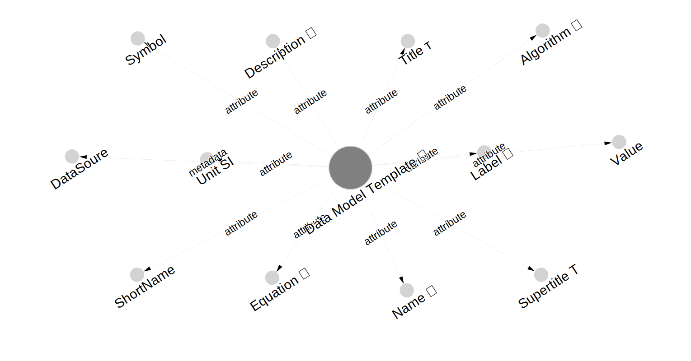
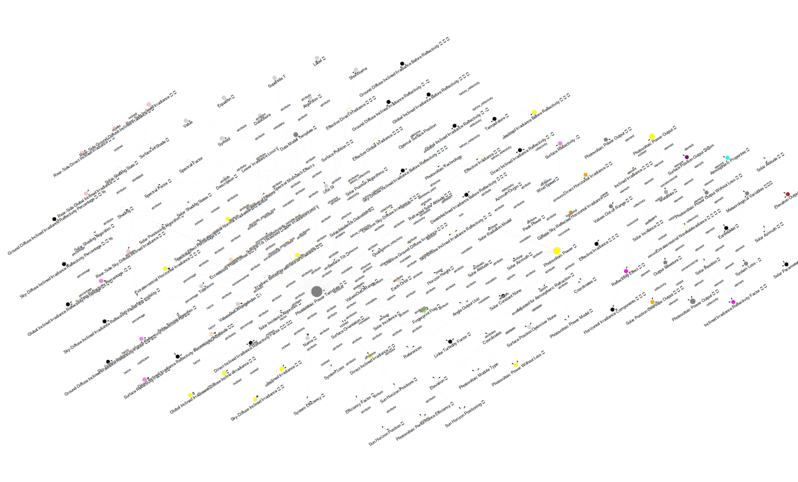

# PVGIS 

##### What is PVGIS ?

The _**P**hotovoltaic **G**eographic **I**nformation **S**ystem_[^*][^**][^***]
is the 🇪🇺  European Commission's
public web service
for estimating photovoltaic ⚡ energy production
and 🔆 solar radiation.

##### Who is PVGIS for ?

***For everyone!***
Citizens & Prosumers,
Professionals
as well as Researchers & Developers
can use the multiple interfaces
giving them the right mix of ease of use and complexity.

##### What is the science behind PVGIS ?

- Solar Positioning : NOOA Solar geometry, Jenčo 1992​
- Irradiance Modelling : Hofierka 2002, Muneer 1990, Martin & Ruiz 2005​
- Photovoltaic Performance : Huld et al. 2011, Faiman 2008

##### Open by Design

**PVGIS**
is developed and maintained by

  > the _Energy Efficiency & Renewables Unit (Ispra)_  
  > under the _Energy, Transport & Climate directorate_  
  > in the _Joint Research Centre_ [(JRC)][JRC], _🇪🇺 European Commission_

This project
is built exclusively from open-source components
and aligns with the [European Open Source
Strategy](https://commission.europa.eu/about/departments-and-executive-agencies/digital-services/open-source-software-strategy_en).

#### ⚠️ Important

This repository hosts **PVGIS 6**,
a brand‑new all‑Python & NumPy implementation of _PVGIS_ [^*].
It is a prototype meant to replace the legacy C/C++ engine
behind the current public web service.

_Expect changes, occasional rough edges, and updates to this `ReadMe` itself._

> An open‑source software article
> describing PVGIS
> 6 is being prepared for the *Journal of Open‑Source Software (JOSS)*.

> 🤝 Please  **Respect Authorship**,
> **Read the Licence Terms**
> and **Contribute Back**
> whenever you reuse or extend the source code.


## PVGIS 6

##### What is PVGIS _version 6_ ?

**PVGIS version 6**  _( <u>this repository</u> )_
is a redevelopment of the software that powers
the European Commission’s public web service for solar energy.
Based on [Python](https://www.python.org/) & [NumPy](https://numpy.org/),
this new version is
fast,
feature‑complete,
and easy to use whether from code or command line.


##### What can PVGIS 6 do ?

**PVGIS**
provides location-specific solar energy calculations
for any point on Earth 🌍 (given appropriate input data)
and supports
researchers, engineers, and solar enthusiasts worldwide
to build informed decisions about solar energy projects.

**A Technical Polyglot for Solar Energy**

PVGIS 6 is both a _scientific_ and a _technical_ polyglot.
Since its inception in 2022,
it has been designed to bridge the diverse worlds of solar-energy stakeholders.

The following slide highlights features that may power a Software-as-a-Service,
yet it showcases the breadth and depth of PVGIS 6’s backend mechanics.


##### **As a Stand-Alone Software**

- ⚡ **Estimate the photovoltaic potential** for various technologies
- 🔆 **Analyse the solar irradiance** -- global, direct and diffuse irradiance components
- ∡ **Solar position analysis** based on various algorithms, the default being NOAA's solar geometry model
- ∡ **Identify the optimal solar positioning** based on various algorithms
- 📈 **Generate time series** of photovoltaic performance, solar radiation, temperature, wind speed
- ⛅ **Compile a Typical Meteorological Year** for climate variables supporting multiple methods [^****]
- 🫆 **Fingerprint** reproducible calculations
- ▒ **QR code** shareable results

[^****]: Pending completion

**Output examples**

PVGIS can export detailed comma-seprarated-values
of photovoltaic power time series
along with contextual variables and factors.

```csv
Longitude,Latitude,Time,Power ⌁,Power ⌁ without Loss,Efficiency ⋅,Extra Normal ⍖ ⦜,Linke Turbidity ⋅,Refracted alt. ⦧ ⦩,Altitude ⦩,Azimuth 󱦥,Incidence ⭸,Sun-Horizon ⛰,Shading state 🮞,In-shade 🮞,Horizon ⛰,Visible 👁
0.13905387216489223,0.8022999318737615,2010-06-01 04:00:00,0.0,0.0,1.0,1322.5853,2.0,2.1876,0.0382,1.05,0.0,Low angle,Potentially-sunlit,False,0.0,True
0.13905387216489223,0.8022999318737615,2010-06-01 05:00:00,10.6838,12.4231,0.754,1322.5853,2.0,11.4159,0.1992,1.2252,0.0,Above,Sunlit,False,0.0,True
0.13905387216489223,0.8022999318737615,2010-06-01 06:00:00,155.9008,181.28,0.9511,1322.5853,2.0,21.4454,0.3743,1.3994,0.222,Above,Sunlit,False,0.0,True
0.13905387216489223,0.8022999318737615,2010-06-01 07:00:00,386.9417,449.9321,0.9466,1322.5853,2.0,31.8096,0.5552,1.5804,0.4628,Above,Sunlit,False,0.0,True
0.13905387216489223,0.8022999318737615,2010-06-01 08:00:00,580.243,674.7012,0.9184,1322.5853,2.0,42.1513,0.7357,1.7841,0.7054,Above,Sunlit,False,0.0,True
0.13905387216489223,0.8022999318737615,2010-06-01 09:00:00,721.9849,839.5173,0.8909,1322.5853,2.0,51.9725,0.9071,2.038,0.9471,Above,Sunlit,False,0.0,True
0.13905387216489223,0.8022999318737615,2010-06-01 10:00:00,813.0165,945.368,0.8705,1322.5853,2.0,60.3432,1.0532,2.3896,1.1827,Above,Sunlit,False,0.0,True
0.13905387216489223,0.8022999318737615,2010-06-01 11:00:00,855.9097,995.2438,0.86,1322.5853,2.0,65.4249,1.1419,2.8925,1.3819,Above,Sunlit,False,0.0,True
0.13905387216489223,0.8022999318737615,2010-06-01 12:00:00,852.4977,991.2764,0.8609,1322.5853,2.0,64.9856,1.1342,3.4748,1.3589,Above,Sunlit,False,0.0,True
0.13905387216489223,0.8022999318737615,2010-06-01 13:00:00,802.624,933.2837,0.8729,1322.5853,2.0,59.2702,1.0345,3.9546,1.1486,Above,Sunlit,False,0.0,True
0.13905387216489223,0.8022999318737615,2010-06-01 14:00:00,704.2533,818.8992,0.8946,1322.5853,2.0,50.6025,0.8832,4.2881,0.9115,Above,Sunlit,False,0.0,True
0.13905387216489223,0.8022999318737615,2010-06-01 15:00:00,554.8862,645.2164,0.9227,1322.5853,2.0,40.6671,0.7098,4.5323,0.6694,Above,Sunlit,False,0.0,True
0.13905387216489223,0.8022999318737615,2010-06-01 16:00:00,354.4035,412.097,0.9499,1322.5853,2.0,30.3035,0.5289,4.7314,0.4271,Above,Sunlit,False,0.0,True
0.13905387216489223,0.8022999318737615,2010-06-01 17:00:00,122.9065,142.9146,0.9438,1322.5853,2.0,19.9763,0.3487,4.9106,0.1868,Above,Sunlit,False,0.0,True
0.13905387216489223,0.8022999318737615,2010-06-01 18:00:00,10.1326,11.7821,0.7481,1322.5853,2.0,10.0374,0.1752,5.0848,0.0,Above,Sunlit,False,0.0,True
0.13905387216489223,0.8022999318737615,2010-06-01 19:00:00,0.0,0.0,1.0,1322.5853,2.0,1.043,0.0182,5.2592,0.0,Low angle,Potentially-sunlit,False,0.0,True
```

and corresponing single-value metadata (as a YAML file)

```yaml
Elevation 🏔: 2000.0
Name: Photovoltaic Power data model
Title: Power
Description: Photovoltaic Power based on a variant of King0s model (1998, 2004)
Symbol: ⌁
Unit: W
Equation: P(G₀, T₀) = G₀(P₀ₛₜ₃, m + k₁G₀) + k₂G₀)² + k₃T₀ + k₄T₀G₀ + k₅T₀G₀² + k₆T₀²
System Efficiency ⋅: 0.86
Unrefracted ⌮: true
Solar constant: 1367.0
Upper physical limit ]: 2000
Lower physical limit [: -4
Azimuth Origin 󱦥: North
Timing ⏲: NOAA
Positioning ⯐: NOAA
Incidence algorithm ⭸: Iqbal
Incidence angle ⭸: Sun-Vector-to-Surface-Plane
Sun-Horizon Positions ⛰:
- above
- low_angle
- below
Shading 🮞: PVGIS
Shading states 🮞:
- all
Photovoltaic Module Type: Mono-Facial
Technology: cSi:Free standing
Peak Power: 1.0
Peak Power Unit: kWp
Power model ⌁: Huld 2011
Radiation model ⸾: Hofierka 2002
Fingerprint 🆔: e07d3d7b3610250a060d91c39187fd8ab75104f4f5603b25356172d298f8b537
Angle Unit: radians
Surface Tilt ⦥: 0.5759586531581288
Surface Orientation ↻: 3.141592653589793
```

**A few screeshots...**

- ⚡ __Photovoltaic Potential__ for various technologies

  

- __Photovoltaic Power__ & __Solar Irradiance Analysis__ for global, direct and
  diffuse Irradiance based on Hofierka (2004)

  

- __Solar Position Analysis__ based on various algorithms, the defaul being NOAA's solar geometry model

  

- Variables of a Typical Meteorological Year via multiple methods

  

  > The TMY engine is pending completion to actually output a _Typical Year_.


##### **As a Service**

> Coming soon.

***

> Refer to the following sections for details and more examples !

---

##### 🌞 How PVGIS 6 works ?

PVGIS processes
large & location‑specific time series
of solar irradiance
and related meteorological variables
to estimate the photovoltaic (PV) power output
over any chosen period that overlaps the temporal span of the input data.

**Data preparation**

Massive continuous time‑series datasets
are sliced into fine spatial “chunks.”
Key is the right chunk size,
i.e., designing an efficient internal data structure.

**On‑the‑fly processing**

Once the chunked time series are ready, however,
PVGIS computes the PV power output
for a given location and time span in real time.
On a modern laptop this typically takes under a second.

> Chunked time series are not required if speed is not a concern.
> PVGIS consumes any kind of data supported by the Xarray library.

[Xarray]: https://docs.xarray.dev


**Performance**

> Coming soon : Update with relevant hardware specifications.

Processing multiple meteorological time series data
over a geographic location
in under a second !


***

<!-- Section References -->

[JRC]: https://joint-research-centre.ec.europa.eu/index_en

[^*]: The official Web API service[^****] [Photovoltaic Geographical Information System version 5.x][PVGIS 5.x] is currently powered by an internal software implementation in C/C++.

[^****]: The _PVGIS Web API 5.x_ receives an etimated traffic of `> 50K` requests / week. See also : [Web Traffic](reference/web_traffic.md).

[^**]: See also the [landing page of the PVGIS Web Application 5.x][PVGIS 5 landing page].

[^***]: __This repository__ implements and documents the _new all‑Python_ backend source code , informally referred to as _PVGIS 6_, that will eventually power future versions of the Web API and Frontend.

[PVGIS 5.x]: https://re.jrc.ec.europa.eu/pvg_tools/en/
[PVGIS 5 landing page]: https://joint-research-centre.ec.europa.eu/photovoltaic-geographical-information-system-pvgis_en

***

## 📚 Documentation

> The Web API documentation is under development — feedback welcome !

***

## 🚀 Quick Start

### Requirements  & Recommendations

- An operating system that supports Python `< 3.12`, `>=3.11`

- Ensure the `gcc` compiler (or equivalent for your OS) is installed to build
  Python C extensions required by `xarray-extras` -- see also
  [Installation of xarray-extras](https://xarray-extras.readthedocs.io/en/latest/installing.html)

- Install the Noto fonts package -- without these, you may encounter failed
  installation, missing characters, or unreadable tables/output in CLI and
  documentation.  See [Noto: A typeface for the world](https://fonts.google.com/noto).

- Gnome's [Console](https://apps.gnome.org/Console/) virtual terminal will
  render properly all UTF-8 characters. Many other show eventually some
  displacement in the command line tabular output.

- A Python virtual environment for a safe & clean installation

- Use `uv` for fast & reliable installations


### Install uv

First, [**install `uv`**](https://docs.astral.sh/uv/getting-started/installation/)

### Simple installation

#### TL;DR 

For the impatient,
launch a terminal,
navigate inside a local directory in your system
and copy-paste-execute the following batch of commands
to install PVGIS using `uv` in a dedicated environment :

```bash
git clone -b main https://code.europa.eu/pvgis/pvgis
cd pvgis
uv venv .pvgis_virtual_environment
source .pvgis_virtual_environment/bin/activate
uv pip install .
pvgis-prototype --version
```

  [](https://asciinema.org/a/SbTqzZDafZuI0IhyIuVJQcINm)

#### Step-by-Step

Would you rather like to understand each step of the installation process ?

A **safe and clean** way to install `pvgis` is
to clone the `main` branch of the source code
and use `uv` to install it in an isolated environment :

##### 1. Clone the source code

Next, clone the source code

```bash
# Inside some local directory in your system
git clone -b main https://code.europa.eu/pvgis/pvgis
cd pvgis
```

##### 2. Create a virtual environment

Before installing PVGIS,
create an isolated virtual environment
to avoid _polluting_ the system.
In addition,
removing a dedicated environment
is easy and leaves no traces behind.

```bash
uv venv .pvgis_virtual_environment
```

##### 3. Install PVGIS

Finally, install PVGIS via

``` bash
source .pvgis_virtual_environment/bin/activate
uv pip install .
```

This will install the algorithms, the core API and the CLI components.

If you wish to install the Web API, then try :

```bash
uv pip install .[web]
```

##### 4. Verify installation

```bash
pvgis-prototype --version
```

If the installation is successful,
and with the virtual environment activated,
we can use PVGIS commands !

```bash
pvgis-prototype --help
```

##### 5. Deactivate the environment

Done working with PVGIS ?
It is good practice to **deactivate the virtual environment** via :

```bash
deactivate
```

### Advanced installation

For active development with automatic environment management,
a nice way is to combine the use of `direnv` and `uv`

#### Prerequisites

1. [**Install `uv`**](https://docs.astral.sh/uv/getting-started/installation/)

2. [**Install direnv**](https://direnv.net/docs/installation.html)

3. [**Hook direnv to your shell**](https://direnv.net/docs/hook.html)

4. Consult [Restoring the PS1](https://github.com/direnv/direnv/wiki/Python#restoring-the-ps1), alternatively [Override $PS1](https://github.com/direnv/direnv/wiki/PS1)

5. [Use `uv` as an environment builder](https://github.com/direnv/direnv/wiki/Python#uv)

#### Setup the project

##### 1. Clone the source code

   See above

##### 2. Let `direnv` manage the virtual environment 

   You may use the following configuration for `direnv` :
   copy it in a file named `.envrc`,
   _inside_ the root directory of PVGIS' source code.

   ```bash
   export VIRTUAL_ENV=.pvgis-prototype_virtual_environment
   export UV_PROJECT_ENVIRONMENT=.pvgis-prototype_virtual_environment
   layout uv
   export CUSTOM_PS1=mycustomPS1
   ```

   and

   ```bash
   direnv allow
   ```

The virtual environment **activates automatically**
whenever we `cd` into the project directory !
Plus,
it **deactivates** once we `cd` out of the project directory !

##### 3. Install PVGIS in _editable_ mode

We can install PVGIS in editable mode
-- every modification to the source code is directly reflected at runtime.

```bash
uv pip install -e .
```

Want to install all of PVGIS ?

```bash
uv pip install -e .[all]
```

This includes
the core API, the CLI, the Web API
and MkDocs to build the documentation.

### Uninstall

Uninstalling everything is as easy as removing the dedicated environment.
However, instead of using the `rm -rf` command
which might be risky
if accidentally executed for a different directory than the intended one,
a safer way is to move unwanted data in the `tmp` directory.

```bash
mv .pvgis_virtual_environment/ /tmp/
```

### Examples

#### Command Line Interface

- Overview of `irradiance`, `power` and `performance` commands

  [](https://asciinema.org/a/jGFGWuP6D99EpJwk3tXjXbnwM)

- ⚡ __Photovoltaic Potential__ for various technologies in grid-connected & stand-alone systems

  > Stand-alone systems yet to implement !

- __Photovoltaic Power__ & __Solar Irradiance Analysis__ for global, direct and
  diffuse Irradiance based on Hofierka (2004)

  Total irradiance for multiple solar surface positions

  

  [](https://asciinema.org/a/NNxHiWa28rl8tSiVuXC9pDdlF)

- __Solar Position Analysis__ based on various algorithms, the defaul being NOAA's solar geometry model

  Short `position` example

  [](https://asciinema.org/a/v5PDV1ukjay4fvj9JTs3H5aqW)

  Somewhat longer `position` example

  [](https://asciinema.org/a/oIkcYpWA3ABetthrCq0nezraa)

  Considering & plotting the horizon

  [](https://asciinema.org/a/pynlwepKNRE6gqKqwPr6JmzTP)

- 🫆 [Fingerprint](cli/fingerprint.md)ed reproducible calculations & ▒ [QR-Code](cli/qrcode.md) shareable results
  
  

  > This QR-Code is _not_ a _link_.
  > It is simple text
  > (i.e. a summary of the output from a photovoltaic performance calculation)
  > encoded as an image !

***

#### Web API

**Launching the Web API server**

- via `uvicorn`

  [](https://asciinema.org/a//pyVWtoDpOwrgrvuDKWmj7FBQ3)

- via `uvicorn` + Redis for caching

  [](https://asciinema.org/a/yNqD2KIAOnyrLpqfBitAxM3xv)

- via `gunicorn` in Production mode + Redis for caching

  [](https://asciinema.org/a/oDmht8NViggLiZT3dLPmQjgxI)

- via `gunicorn` in Development mode + Redis for caching

  [](https://asciinema.org/a/5n3inVU90yBlla1mA3Y8ke2o0)

**Scalability**

Scalability tests are on-going and pending completion.  As there is no-one
universal solution out there for caching and scaling a Web API server, it'll
take some time to get the right fine tuning.  However, the Web API is
functional and performant. And it seems to scale rather satisfying with a great
margin for further improvement.

The following example demonstrates a mini-scalability test.

  [](https://asciinema.org/a/03wWgzLwUzVEnxaGcQ7LKnFCt)

In addition,
the following summary of tests in some workstation-grade hardware,
verify the expectations for a fast and responsive Web API service

| 🔁 Batch Size | 🖱️ Requests | ✅ Success Rate | ⏱️ Duration (s) | ⏲️ Avg Time / Request (s) | 🚀 Requests / Sec | 🗃️ Cache Entries | 📦 Output Size | 🔗 Endpoint           |
|---------------|-------------|-----------------|-----------------|---------------------------|-------------------|------------------|----------------|-----------------------|
| 100           | 10,000      | 99.98%          | 335.07          | 0.033                     | 29.84             | 9,934            | ~9MB           | /power/broadband-demo |
| 200           | 10,000      | 99.99%          | 246.65          | 0.025                     | 40.54             | 9,902            | ~9MB           | /power/broadband-demo |
| 500           | 10,000      | 100%            | 191.73          | 0.019                     | 52.15             | 9,902            | ~9MB           | /power/broadband-demo |
| 1000          | 10,000      | 99.99%          | 177.23          | 0.017                     | 56.42             | 9,924            | ~9MB           | /power/broadband-demo |
| 500           | 10,000      | 99.97%          | 333.60          | 0.033                     | 29.97             | 7,024            | ~32MB          | /performance          |
| 1000          | 10,000      | 95.63%          | 296.88          | 0.030                     | 33.68             | 8,282            | ~32MB          | /performance          |


***

#### Core API

> Coming soon.

***

## ❓ Support

- Start a discussion or report a bug at [Issues](https://code.europa.eu/help/user/project/issues/_index).

- [Email a new issue to this project](incoming+pvgis-pvgis-1214-glimt-3gnpjin6holihasgz68cfya30-issue@code.europa.eu).

- Build the documentation locally; see also the relevant part in
  the `Installation` section.

***

## 🔓 PVGIS 6 is __Open by Design__

> *Public Money 👥💶, Public Code 👥`01`*  

{align=right height=100px width=100px}

- Core [API](#) based on NumPy
- [Web API](#) based on FastAPI
- [CLI](#) based on Typer

***

## 📜 License

PVGIS is released under the **European Union Public Licence (EUPL) v1.2**.
This ensures the software remains open and freely available
while protecting both contributors and users.

See :

- [LICENSE](LICENSE) for full details
- [NOTICE](NOTICE) for licenses of software used by PVGIS that is developed by third parties

> 🤝 Please  **Respect Authorship**,
> **Read the Licence Terms**
> and **Contribute Back**
> whenever you reuse or extend the source code.

***

## 🧮 Supported Algorithms

PVGIS implements multiple scientific algorithms for accuracy and quality.

### Solar Position Algorithms

- **NOAA** - National Oceanic & Atmospheric Administration
- **Jenčo** - High-precision calculations optimized for solar applications

### Irradiance Models

- **Hofierka (2002)** - Clear-sky solar radiation model
- **Muneer** - Diffuse irradiance calculations
- **Martin & Ruiz** - Loss due to surface reflectivity

### PV Performance Models  

- **Huld et al.** - Modified photovoltaic power model based on _King_
- **Faiman** - Cell temperature effect

### Spectral Mismatch Effect

> Section to Update

- **Pelland**
- **pvlib**
- **ISO**

***

## 🛠️ Developer's Corner

### Philosophy of the Codebase  

> Show **what**, abstract **how**.  
> Science up front, mechanics under the hood.

<details>
<summary>YAML-based data structure definitions</summary>

  Core data model entities are described once in YAML.  
  Recursive loaders convert YAML into rich Python dictionaries and Pydantic models.  
  Complex relationships may be visualised as graphs
  to uncover redundant structures, reveal hidden coupling, and guide refactors.

</details>

<details>
<summary>Backend complexity, frontend simplicity</summary>

  Heavyweight scientific logic lives in tested algorithmic modules.  
  Power-users can interact through predictable surfaces :  
  concise CLI commands, a clean API, or a Web API.

</details>

<details>
<summary>Declarative, not imperative</summary>

  Algorithms should read like a _Methods_ section !

  Domain-specific models
  such as for solar positioning,
  solar-energy physics
  and photovoltaic performance analysis,
  describe the computation.
  
  The engine executes it
  hiding vectorisation, caching and type-safety
  behind abstractions, i.e. classes and helper factories.

</details>

<details>
<summary>Explicit contracts, implicit mechanics</summary>

  Make inputs, outputs, units and assumptions
  explicit in signatures and documentation strings.

  Encapsulate performance details and parallelism.

</details>

<details>
<summary>Function names carry the physics</summary>

  Domain-specific terms in public APIs.  
  Implementation jargon stays private.
  However and whenever possible, _jargon is scientific too_ !

</details>

<details>
<summary>Types, tests, reproducibility</summary>

  Careful typing
  and focused tests guard correctness.
  Fingerprint outputs
  and track regressions to preserve scientific reference.

</details>

### Technical Stack  


| Layer | Technology & Purpose |
|-------|----------------------|
| Core numerics | **Python 3 + NumPy** for vectorised math |
| Multidimensional I/O | **Xarray** for labelled time-series and gridded climate data |
| CLI | **Typer** – discoverable commands, auto-generated help |
| Web API | **FastAPI** – async, OpenAPI docs, CORS-ready |


### 🏗️ Architecture

At first, the PVGIS 6 source code may appear complex.
Yet it is structured as clean, modular
and tightly interdependent components :

- data models defined **in YAML**
- a collection of scientific algorithms  
  (solar position, irradiance, photovoltaic performance)
- the Core API  
  (pure array calculations)
- the CLI (based on Typer) and the Web API (built with FastAPI) interfaces
- tests, type hints, a unified logger and in-depth documentation


Rooted in open‑source,
PVGIS builds on widely established libraries
such as for example [NumPy][NumPy] and [Pandas][Pandas].

> The graph
> (generated with [Gource][Gource] on 22 October 2024),
> visualizes the code structure,
> by mapping files as nodes
> and directories as connecting edges.
> It highlights across-system dependencies
> while also revealing the functional possibilities
> of the architecture.

***

## 🏗️ Data-Model Engineering

In PVGIS 6 **scientific data structures are defined in YAML, not Python**.
A transformation engine generates Python-native data models.
This separation enables domain scientists to shape models and data structures
while developers maintain a transformation engine.

- Core entities are **described once in YAML**.  
- Recursive loaders convert YAML into rich Python dictionaries and Pydantic models.  
- Complex relationships may be **visualised as graphs** to uncover redundant structures, reveal hidden coupling, and guide refactors.

#### 📐 A layered architecture

##### 1 YAML definitions

Atomic YAML files declare data structures—field names, types, units, dependencies—in a clean, programming-language-agnostic format. A scientist defines `GlobalInclinedIrradiance` by listing its physical components (direct beam, diffuse sky, ground reflection) without writing Python.

The `require:` directive enables **compositional inheritance**: a model pulls attributes from multiple parent templates, reusing common patterns (timestamps, location metadata) while adding domain-specific fields (Linke turbidity, albedo, temperature coefficients).

##### 2 Definition factory

The `generate.py` script orchestrates a **graph-based resolution algorithm**:

```bash
python generate.py --log-level DEBUG --log-file definitions.log
```

A safe and reusable command to run and generate the `definitions.py` is :
```bash
yes "yes" | rm definitions.py && echo "PVGIS_DATA_MODEL_DEFINITIONS = {}" > definitions.py && python generate.py --log-level DEBUG --log-file definitions.log
```


This function

- Loads YAML files and parses `require:` directives (inheritance declarations)
- Traverses dependency trees using **recursive descent**, detecting circular references
- Merges parent attributes into child models via deep-merge logic
- Generates a consolidated `definitions.py` containing fully expanded model specifications

This approach collapses complex inheritance chains (e.g., `SolarAltitude` → `DataModelTemplate` → `BaseTemplate`) into a single, self-contained definition.

A future task for the project would be to run this _generation_ automatically at installation time !

##### 3 Runtime factories

**DataModelFactory** dynamically generates Pydantic models:

```python
from pvgisprototype import SolarAzimuth  # Factory lookup → instantiation
```

The factory maps YAML type strings to Python types, injects NumPy array handling, and enables validation that catches errors like **missing required fields, incorrect data types, incompatible array shapes, or out-of-range values** before calculations proceed.

Functions of the context factory transform model instances into structured outputs :

```python
result.build_output(verbose=2)  # Nested dict ready for API/CLI/Web API
```

The above reads output structure definitions from YAML,
evaluates conditional sections (e.g., verbosity levels),
and constructs nested dictionaries representing calculation results.
This ensures API responses, CLI output, and documentation remain synchronized.

#### 🔄 Command and data object lifecycle

Data models exist **transiently**—instantiated on-demand, used during calculation, garbage-collected immediately after:

**1. Import**

```python
from pvgisprototype import GlobalInclinedIrradiance
```

Models are imported from the consolidated `definitions.py` module.

**2. Factory generation**

At runtime, **DataModelFactory** retrieves the model's definition and dynamically generates a Pydantic class.

**3. Calculation**

Models are typically returned by calculation functions:

```python
def calculate_solar_position(latitude, longitude, timestamp):
    # ... calculations ...
    return SolarAzimuth(
        value=azimuth_array,
        solaraltitude=altitude_array,
        timestamp=timestamp,
        location=(latitude, longitude)
    )
```

Pydantic validation occurs immediately upon instantiation, ensuring downstream functions receive well-formed, type-safe data.

**4. Output Generation**

Each data model embeds an output structure definition describing how its attributes should be presented. The **ContextBuilder** reads this structure and calls the model's `.build_output()` method:

```python
result = calculate_solar_position(lat, lon, time)
output = result.build_output(verbose=2)
```

This populates the `output` attribute automatically—a structured dict ready for consumption by:

- **Web API endpoints** (JSON responses)
- **CLI tools** (formatted terminal output)
- **Core API functions** (programmatic access)

**5. Expiration**

Once output is returned, the model instance is garbage-collected. No persistent state remains between requests, ensuring thread safety and predictable memory usage in multi-user environments.

#### 🌐 Language-Agnostic Philosophy

YAML definitions are intentionally **programming-free**. This way they can be
reused in other contexts and programming languages.
Another experimental idea/feature embeds *dependency annotations*
(e.g., "GlobalInclinedIrradiance requires: direct beam, diffuse sky, tilt angle")
that may serve as **executable documentation**.
While the current prototype doesn't really/fully exploit such annotations,
they enable:

- **Cross-platform model reuse** (parsers in Julia, R, JavaScript could regenerate workflows)
- **Transparent calculation pipelines** (researchers see required inputs without reading code)
- **Automated dependency graphs** (visualize model relationships)

#### Graph visualisation & more 

PVGIS can visualise its own data model graphs.

**Examples**

The `data_model_template.yaml` is  

```yaml
name: DataModelTemplate
label: Data Model Template
description: A generic template for data models
symbol: ⎄
color: gray

require:
 
  # Identifier attributes
  - attribute/name
  - attribute/shortname
  - attribute/supertitle
  - attribute/title
  - attribute/label
  - attribute/description
  - attribute/symbol

  # Values
  - attribute/value
  - attribute/unit

  # Metadata attribute
  - attribute/algorithm
  - attribute/equation
  - metadata/data_source
```

and brings in various _attributes_ to build a template data model.

For example, the `symbol` attribute is described in a YAML file itself

```yaml
name: SymbolAttribute
label: Symbol
description: Attribute for a symbol of a data model
color: lightgray

sections:

  symbol:
    type: str
    title: Symbol
    description: Symbol for the data model
    initial:

```

We can visualise the _template_ via :

```bash
pvgis-prototype data-model --log-file data_model.log visualise gravis-d3 --yaml-file  definitions.yaml/data_model_template.yaml
```

will generate an dynamic and clickable HTML file (here an SVG export of it is shown)


  


This is for example the generic template which many data model definitions use.

The mostly complex photovltaic power output data structure can be visualised
visualised

```bash
rm data_model_graph.html  # first -- or fix-the CLI to overwrite this !
pvgis-prototype data-model visualise gravis-d3 --yaml-file  definitions.yaml/power/photovoltaic.yaml
```

  


> Ditto, this image is unreadable.  Generate the HTML file, open and explore it
> in your browser !


#### ⚖️ The trade-off

**Why this complexity?**

PVGIS counts a large number of interconnected data models
that may evolve as solar research advances.
Changes to irradiance algorithms, metadata structures,
or output formats propagate through YAML edits—not scattered code modifications.
Domain experts can contribute directly to model definitions
while developers can focus in the transformation engine.

**Acknowledged limitations**  

- **Learning curve**: Understanding `require` chains requires conceptual investment
- **Debugging difficulty**: YAML merge errors can be opaque—yet the build process generates detailed logs
- **Build-time dependency**: Changes require regenerating `definitions.py`

**Future work**  

A refactoring pass will migrate hardcoded values from `constants.py`
into YAML definitions,
completing the separation of domain knowledge from implementation.

#### 🎯 This approach is...

- Managing **dozens of similar but distinct** data structures
- Enabling **cross-disciplinary collaboration** (scientists define models, engineers build infrastructure)
- Supporting **rapidly changing domain requirements** (new algorithms, extended outputs)
- Ensuring **long-term maintainability** over immediate simplicity

This architecture prioritizes **scientific transparency** and **future flexibility** over ease of onboarding—a deliberate trade-off recognizing that PVGIS models will outlive any single development team.

### **Unified logger**


[NumPy]: https://numpy.org
[Pandas]: https://pandas.pydata.org
[Gource]: https://gource.io/

***

## ❔ Questions & Answers

### Why is this a Prototype ?

PVGIS 6 is partly **research-grade software under active development**.
Treat current releases as beta snapshots:

- API signatures may still evolve.  
- Algorithms are being benchmarked against reference datasets.  
- Documentation is though updated irregularly !

### Why this and not that ?

Why so and not otherwise ?

> Update me further !

- SymPy vs. NumPy

  At first,
  [SymPy](https://www.sympy.org)'s symbolic power looked attractive.
  However, concerns over runtime performance
  and the need for instant calculations on massive time‑series,
  led to a pure-NumPy implementation 
  whose numerical kernels are highly optimised.

- Typer vs. Cyclopts (CLI)

  When the CLI was first sketched,
  Typer was already mature, widely used, and backed by an active community.
  [Cyclopts](https://cyclopts.readthedocs.io) was promising
  yet still new with a single maintainer.
  Typer was chosen in order to reduce risk and guarantee long‑term support,
  albeit accepting some performance overhead
  compared with the leaner Cyclopts design.

- Pint vs. Custom Unit Attributes

  Although [pint](https://pint.readthedocs.io) provides a robust,
  standards‑compliant unit system,
  it slipped under the radar during the early stages of development.
  Instead of retrofitting an external dependency
  into an already‑stable codebase,
  PVGIS implements its own data models and unit attributes.

***

## 🏤 Contact

**Postal Address**

> European Commission, Joint Research Centre  
> Energy Efficiency and Renewables Unit  
> via E. Fermi 2749, TP 450  
> I-21027 Ispra (VA)  
> Italy

***

## 🙏 Acknowledgments

PVGIS
is developed and maintained by
the **Joint Research Centre (JRC)**
of the European Commission.

Thanks to :

- The Energy Efficiency & Renewables Unit team
- The global PVGIS user community  
- Contributors and open-source maintainers
- Scientific algorithm authors and researchers

Specifically and Especially to :

**EuroHPC**

For granting access to the
[MeluXina](https://www.eurohpc-ju.europa.eu/index_en) supercomputer
in which the first experiments of
fine-chunked in-space & contiguous in-time large time series
were performed.

**Joerg Trentmann** & **Uwe Pfeifroth** (DWD)

For thoroughly reviewing and discussing together
early versions of the source code for fundamental functions in solar irradiance,
and invaluable support
on working with solar irradiance time series from the SARAHx climate records.

**Sepand Kashani** (previously EPFL | core developer in [pyxu](https://pyxu-org.github.io/))

For early discussions and guidance
in shaping a modern high-performance Python-based software architecture
that set the technical foundation for PVGIS 6.

**Alexandros Nikolaos Ziogas** (ETH Zürich)

For early problem-solving insights
around high-performance computing with Python
and optimization strategies.

**Ruben Urraca** (JRC)

For his exceptional contributions
to better understand both theoretical and practical aspects of solar science,
critical reviews, and discussions shaping the performance analysis workflow
and ensuring scientific rigor.

**Blago Mihaylov** & **Diego Pavanello** (JRC)

For support in better understanding and implementing functions for the spectral
mismatch effect.

**Martin Durant** ([Dask](https://pyxu-org.github.io/), [Zarr](https://zarr.readthedocs.io/en/stable/))  
**Adam Jensen** & **Kevin Anderson** ([pvlib](https://pvlib-python.readthedocs.io/en/stable/))

For their invaluable time contributig to a _developers meeting_
suggesting problem-solving ideas.

---

## The development team

  - Nikos Aleandris (former contract staff) : Lead
  - Alexandros Falangas (external contractor) : Tests, Web API, All-around  
  - Olympia Gounari (external contractor) : Contributions to data model factory, Horizon shading & more
  - Alba Santos (ex Trainee) : Optimal positioning of solar surface position (Traineeship)

***

> **Made by the European Commission for the global solar community**.

_Consider checking the “Think Before Printing” guide before printing this README: https://thinkbeforeprinting.org/_
