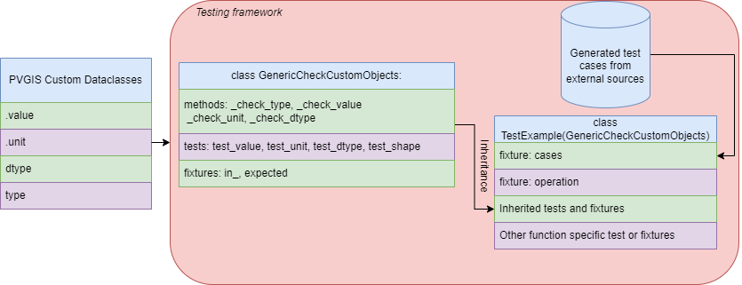

!!! warning
    
    This page is under development.

<div class="grid cards" markdown>

- __Running tests locally__

    Installation of testing dependencies and running the implemented tests.

- __Testing framework__

    Explanation of the current testing framework and addition of test cases.
    
</div>





## Running tests locally

Tests can run locally using [pytest](https://docs.pytest.org/en/). Ensure that the package and the testing requirements listed in the pyproject.toml test section are installed in python environment. In order to install PVGIS with the testing dependencies a user can run:

```python
pip install -e ".[test]"
pytest
```

## Testing Framework

### About

PVGIS is currenly supported by Pydantic dynamic generated objects as a return type 
of all functions. These objects share some specific attributes such as `.value` that contains always array like information and `.unit`, and some case specific metadata attributes. Based on this common design a generic class for testing is implememented in the main `conftest.py` containing generic tests including testing of object `type`, data `dtype`, `unit`, `shape` of the array like information and `value` in multiple tolerance levels. Bellow the content of the generic class is presented:

```python

import pytest
from numpy import isclose

TOLERANCE_LEVELS = [1, 1e-1, 1e-2]


class GenericCheckCustomObjects:
    """Check structure of Pydantic custom objects.
    """

    @staticmethod
    def _check_type(in_, expected):
        assert type(in_) == type(expected)
    
    @staticmethod
    def _check_value(in_, expected, tolerance:float):
        assert isclose(in_.value, expected.value, atol = tolerance).all()

    @staticmethod
    def _check_unit(in_, expected):
        assert in_.unit == expected.unit

    @staticmethod
    def _check_dtype(in_, expected):
        assert in_.value.dtype == expected.value.dtype

    @staticmethod
    def _check_shape(in_, expected):
        assert in_.value.shape == expected.value.shape

    @pytest.fixture
    def in_(self, operation, cases):
        return operation(**cases[0])
    
    @pytest.fixture
    def expected(self, cases):
        return cases[1]
    
    def test_type(self, in_, expected):
        self._check_type(in_, expected)

    @pytest.mark.parametrize('tolerance', TOLERANCE_LEVELS)
    def test_value(self, in_, expected, tolerance:float):
        self._check_value(in_, expected, tolerance=tolerance)
    
    def test_unit(self, in_, expected,):
        self._check_unit(in_, expected)
    
    def test_dtype(self, in_, expected,):
        self._check_dtype(in_, expected)

    def test_shape(self, in_, expected):
        self._check_shape(in_, expected)
```

This generic class is then inherited by a test class specificically desinged to test a function of the software. For example for testing `pvgisprototype.algorithms.noaa.fractional_year.calculate_fractional_year_series_noaa` function the test class should be like:

```python

import pytest
from pvgisprototype.algorithms.noaa.fractional_year import calculate_fractional_year_series_noaa

from .cases.fractional_year_noaa import cases_fractional_year_noaa 
from .cases.fractional_year_noaa import cases_fractional_year_noaa_ids
from .cases.fractional_year_noaa import cases_fractional_year_noaa_invalid
from ..conftest import GenericCheckCustomObjects


class TestCalculateFractionalYearNOAA(GenericCheckCustomObjects):

    @pytest.fixture(params=cases_fractional_year_noaa, ids=cases_fractional_year_noaa_ids)
    def cases(self, request):
        return request.param

    @pytest.fixture
    def operation(self):
        return calculate_fractional_year_series_noaa
    
    @pytest.fixture(params=cases_fractional_year_noaa_invalid)
    def in_invalid(self, request):
        return request.param
    
    def test_invalid_input_datetime_string(self, in_invalid, operation):
        with pytest.raises(in_invalid[1]):  
            _ = operation(**in_invalid[0])
```

where class `TestCalculateFractionalYearNOAA` inherits all the methods from the generic class, thus all the predifined tests and contains as well the fixtures to read the cases from file `.cases.fractional_year_noaa`. Also contains an extra test for testing invalid input (`test_invalid_input_datetime_string`) and a fixture for reading those cases as well (`in_invalid`).

### Generating cases for testing

For generating cases for testing mostly information from external sources is used and is converted to a python `list` containing multiple python dictonaries with the input of the function and the expected values.
For example using the excel `Algorithms_NOAA.xlsx` and the script in `tests/generators/algorithms_noaa_test_generator.py` the file `tests/algorithms/noaa/cases/cases_fractional_year.py` is generated. Then this file is used for reading the cases from the pytest fixtures.