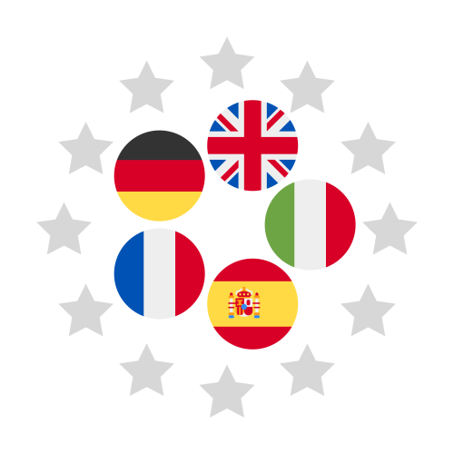

 
 
 
---

# Welcome

:material-human-greeting-variant: Welcome to the documentation of
the Photovoltaic Geographical Information System (PVGIS).

The content is designed to help you navigate through
the features, capabilities, and detailed references
for the PVGIS command line interface (CLI),
its Web application programming interface (Web API),
or even its core API[^0].

[^0]:!!! warning

        The _Web_ API is not the same at the _core_ API.
        The former _consumes_ the latter
        to produce a FastAPI-based Web API interface.

# What is PVGIS ?

[PVGIS][PVGIS]
is an open [web application][PVGIS Web Application]
of the :flag_eu: European Commission.
Is it developed and maintained
in the [Joint Research Centre (JRC)][JRC]
for over two decades
by the Energy Efficiency and Renewables Unit (Ispra) of the Energy,
Transport and Climate directorate.

[JRC]: https://joint-research-centre.ec.europa.eu/index_en

## Features & Capabilities

PVGIS
offers cost-free public service insights
on solar radiation and photovoltaic performance,
providing location-specific estimates of power output
for systems using various PV (Photo Voltaic) technologies.

- :material-solar-power-variant:{ .lg .middle } __Photovoltaic Potential__

    ---
    Various technologies

    - :material-power-plug: Grid-connected
    - :material-battery-high: Stand-alone

    Models available in [PVMAPS](https://ec.europa.eu/jrc/en/PVGIS/downloads/PVMAPS) 

- :octicons-graph-24:{ .lg .middle } __Time Series__

    ---

    - :material-solar-power: PV Performance 
    - :material-sun-wireless-outline: Solar Radiation
    - :material-thermometer: Temperature & :wind_blowing_face: Wind Speed 
    - :material-weather-partly-cloudy: Typical Meteorological Year for 9 climate variables
    
- :material-map:{ .lg .middle } __Coverage & Maps__ [^1]

    ---

    - Europe & Africa :earth_africa:
    - Largely Asia :earth_asia:
    - America :earth_americas:
    - Country/regional maps of solar resource & PV potential

[^1]:!!! warning "Printing ?"

        [:thinking: https://thinkbeforeprinting.org/](https://thinkbeforeprinting.org/)

- :octicons-feed-public-16:{ .lg .middle } __Public Service__

    ---

    {align=right height=100px width=100px}

    - :material-currency-eur-off: Cost free & Open access
    - :material-search-web: 50+K Web API requests / week
    - :material-open-source-initiative: Open Source license EUPL-1.2

    [:octicons-arrow-right-24: License](#)

- :material-translate:{ .lg .middle } __Languages__

    ---

    

- __Components__

    ---

    - :material-language-python: Python [API](#)
    - :material-console: [CLI](#) based on Typer
    - :material-web: [Web API](#)
    based on :simple-fastapi: FastAPI

For a full list of features, see the [Features](overview/features.md) page.

## Getting Started

If you're new to PVGIS' Web API,
start with our entry level [Basic Usage](tutorial/basic_usage.md) guide
to get up and running quickly.

## Advanced Topics

For advanced users,
we offer in-depth guides and discussions on more complex aspects of PVGIS API:

- [Advanced Use](tutorial/advanced_use.md)

## Development

- [Roadmap & Progress](development/roadmap_and_progress.md)
- [Performance Optimization](development/performance_optimisation.md)
- [Adding New Features](development/adding_new_features.md)

### Contributing

If you're interested in contributing,
please read our [Contribution Guidelines](development/contribution_guidelines.md).

!!! note

    PVGIS aims to become an open-source project.
    It will welcome contributions of all forms.

# Support & Community

If you have questions or need support,
join our [Community Forum](support/community_forum.md)
or check out the [FAQ](support/faq.md) section.

Thank you for choosing PVGIS for your solar irradiance calculation needs!
:fontawesome-solid-hands-praying:

### Contact points

- :material-at: __Support Mailbox__

    ---

    Questions and comments can be sent to our mailbox:

    [JRC-PVGIS@ec.europa.eu](JRC-PVGIS@ec.europa.eu)

- :fontawesome-solid-map-location-dot: __Postal Address__

    ---

    European Commission, Joint Research Centre
    Energy Efficiency and Renewables Unit
    via E. Fermi 2749, TP 450
    I-21027 Ispra (VA)
    Italy

[PVGIS]: https://joint-research-centre.ec.europa.eu/photovoltaic-geographical-information-system-pvgis_en

[PVGIS Web Application]: https://re.jrc.ec.europa.eu/pvg_tools/en/
